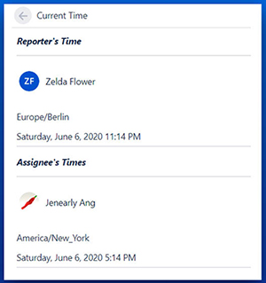

# Atlassian Forge app

Welcome to my plugin for Atlassian's Jira issue page on the right side called ***Current Time***

## Why Current Time 

Current Time shows the current time for the Reporter on an issue ticket and/or the Assignee. This is beneficial for those working with others from around the world. No more asking ***"What time is it in Hong Kong?"*** in google when you can simply click on the link. 

## How was it built 

This plugin was created with Atlassian Forge by simply utilizing their Forge UI API. I've also added momentjs to retrieve and format the time. So basically, momentjs put in 90% of the work. Thank you MomentJs. 

## To Add it to your app

To be able to use this app, you need to have `@forge/cli`

`npm install -g @forge/cli`

Download everything and navigate to the folder 

`forge install` And follow the steps to add it to your Jira setup. 